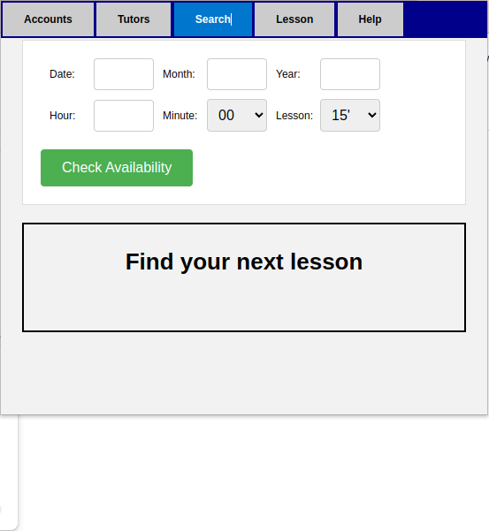
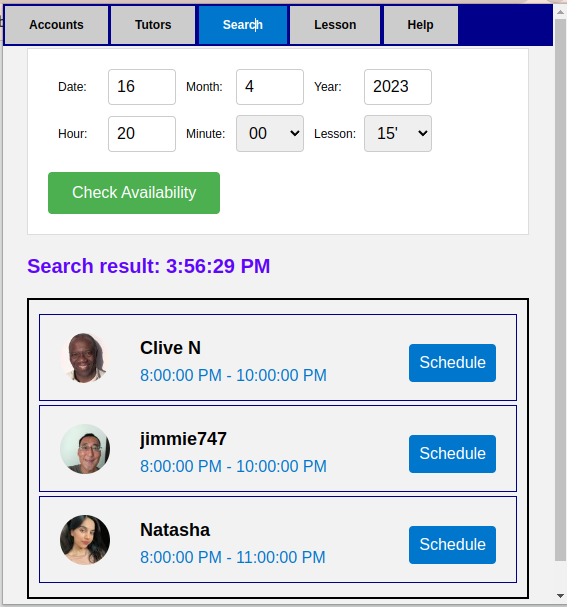
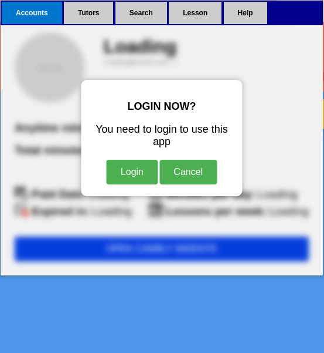
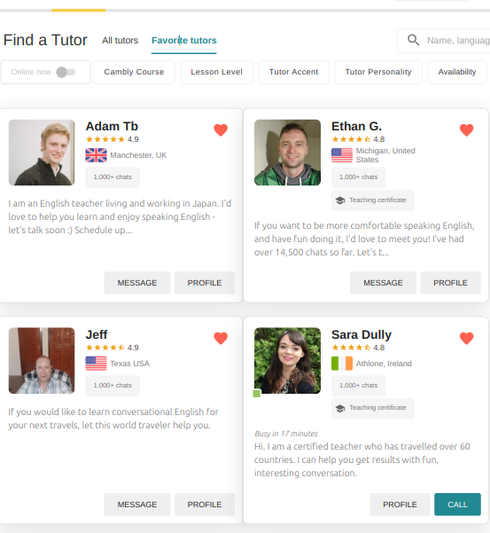
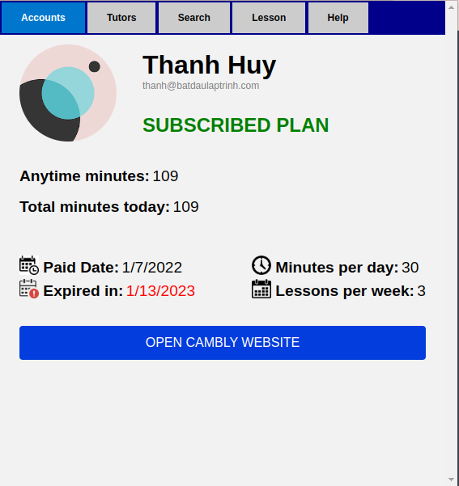
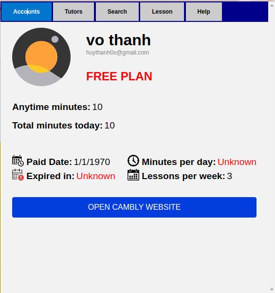
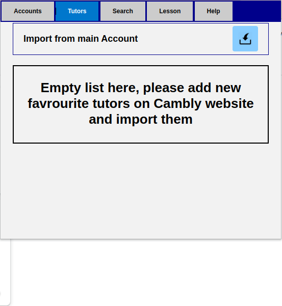
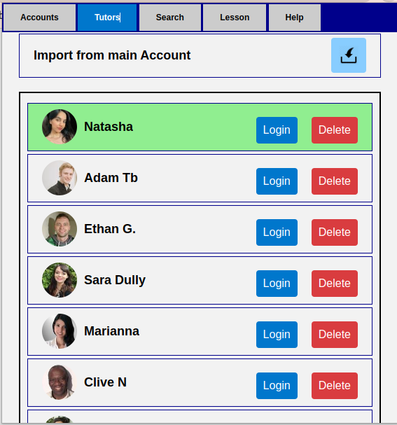
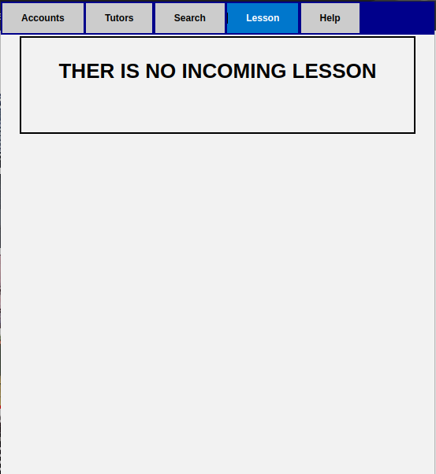
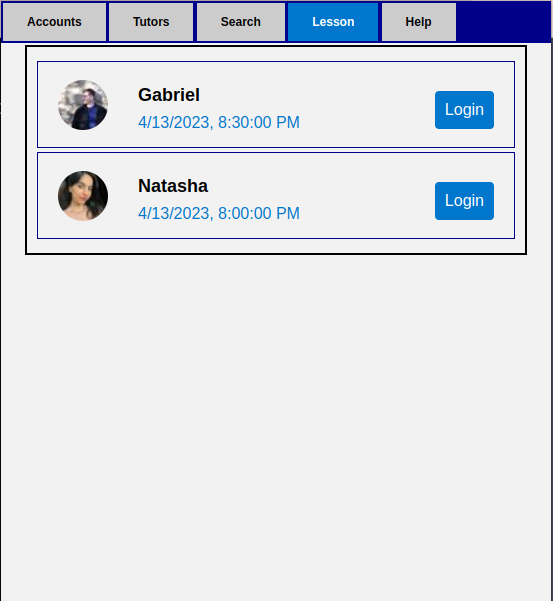

# Introduction

This is a small Chrome extension designed to help Cambly users, with a focus on paid users. The extension provides the following features:

- View general account information such as remaining minutes and expiration date.
- Check if your favorite tutors are online and quickly access their profiles.
- Search for available lessons/schedules from your favorite tutors and easily access their calendars.
- View all incoming (reserved) lessons.

# Installation

To install the extension, follow these steps:

1. Clone the repository or download the source code.
2. Open Google Chrome and go to `chrome://extensions/`.
3. Enable Developer mode.
4. Click on "Load unpacked" and select the folder where you cloned/downloaded the source code.


# Usage

After installation, click on the extension icon in your browser to access the features. 


# Some notes

- It's an unofficial Cambly extension for personal use only

# Some screenshots

<!-- 
 -->

|  |  |
| :---: | :---: |
| *Before searching for tutors* | *Favourite tutors on **official website*** |

|  |  |
| :---: | :---: |
| *Subcribed plan profile* | *Free plan profile* |

|  |  |
| :---: | :---: |
| *Before searching for tutors* | *Searching for tutors* |


|  |  |
| :---: | :---: |
| *Empty favourite tutor list* | *Favourite tutors list* |


|  |  |
| :---: | :---: |
| *Empty scheduled lesson* | *Scheduled lessons* |


# Some unofficial API from Cambly 

### Get current user ID

```
https://www.cambly.com/api/ad_reporting_pendings/current?viewAs=student&_=1681263540810
```

Sample response

```
    {
    "result": {
        "userId": "xxx",
        "pending": [
        
            ],
        "id": "xxx"
        }
    }
```

### Get user general info 

```
https://www.cambly.com/api/users/current?scrub=true&_=1681263540805
```

Sample response

<details>
    <summary> Click to show hidden info</summary>
    <pre style="background-color: #f0f0f0;">
    {
    "result": {
        "subscriptionInfo": {
        "type": "xxx",
        "category": "xxx",
        "minutesPerDay": "xxx",
        "daysPerWeek": "xxx"
        },
        "paid": "xxx",
        "language": "xxx",
        "first_name": "xxx",
        "allowPaymentInstallments": "xxx",
        "dismissedCurriculumBanner": "xxx",
        "planState": "xxx",
        "timezone": "xxx",
        "id": "xxx",
        "accountTypes": [
        "xxx",
        "xxx"
        ],
        "allowCameraToggle": "xxx",
        "planPerWeek": "xxx",
        "hasSeenWalkthrough": "xxx",
        "displayName": "xxx",
        "geoCountry": "xxx",
        "locale": "xxx",
        "planWillRenew": "xxx",
        "expKey": "xxx",
        "avatarUrlDict": {
        "40": "xxx",
        "80": "xxx",
        "200": "xxx",
        "330": "xxx",
        "400": "xxx",
        "full": "xxx"
        },
        "subscriptionPurchaseId": "xxx",
        "email": "xxx",
        "minutes": "xxx",
        "planMinutesPerDay": "xxx",
        "gender": "xxx",
        "autoSyncCalendar": "xxx",
        "userId": "xxx",
        "avatarDynamicUrl": "xxx",
        "firstTimeKidsUser": "xxx",
        "planType": "xxx",
        "_id": {
        "$oid": "xxx"
        },
        "tutorRating": {
        "en": {}
        },
        "country": "xxx",
        "useClassroom": "xxx",
        "webPushNotifs": "xxx",
        "emailVerified": "xxx",
        "adReportingId": "xxx",
        "account": {
        "parent": {
            "active": "xxx",
            "signupTime": {
            "$date": "xxx"
            }
        },
        "student": {
            "active": "xxx",
            "language": {
                "en": {
                    "active": "xxx"
                }
            },
            "signupTime": {
                "$date": "xxx"
            },
            "languages": [
                "xxx"
            ]
        }
        },
        "refreshDelayHours": "xxx",
        "phoneNumber": "xxx",
        "last_name": "xxx",
        "planPayment": "xxx",
        "avatarUrl": "xxx",
        "hasPassword": "xxx",
        "planWeekdaysUsed": "xxx",
        "signupProfile": {},
        "kidIds": [],
        "zendeskOrgName": "xxx",
        "anytimeMinutes": "xxx",
        "conversionDate": {
            "$date": "xxx"
        },
        "hasParentalPin": "xxx",
        "username": "xxx",
        "tutorFilterFacets": {},
        "preferredAccountType": "xxx",
        "tutorLock": [
            "xxx"
            ],
        "expiredPlan": "xxx"
        }
    }
    </pre>
</details>


### Get minute balance

```
https://www.cambly.com/api/student_balances?studentId=STUDENT_ID&viewAs=student&_=1681263540832
```

Sample response

<details>
    <summary> Click to show hidden info</summary>
    <pre style="background-color: #f0f0f0;">
    {
        "result": [
        {
            "planMinutesAvailable": "xxx",
            "snoozeEndTime": "xxx",
            "refreshInterval": "xxx",
            "isSnoozed": "xxx",
            "planMinutes": "xxx",
            "studentId": "xxx",
            "anytimeMinutesAvailable": "xxx",
            "endTime": {
            "$date": "xxx"
            },
            "planMinutesAvailableInWeek": "xxx",
            "isSubscribed": "xxx",
            "anytimeMinutes": "xxx",
            "id": "xxx",
            "availableLessonLengths": [
            "xxx",
            "xxx",
            "xxx",
            "xxx",
            "xxx"
            ],
            "startTime": {
            "$date": "xxx"
            }
        }
        ]
    }
    </pre>
</details>

### Get favourite tutors list

```
https://www.cambly.com/api/favorite_tutors?userId=STUDENT_ID&scrub=true&_=1681263540815
```

Sample response

<details>
    <summary> Click to show hidden info</summary>
    <pre style="background-color: #f0f0f0;">
    result": [
        {
        "_id": {
            "$oid": "xxx"
        },
        "userId": "xxx",
        "tutorId": "xxx",
        "active": true,
        "id": "xxx"
        }
    ]
    </pre>
</details>

### Get tutor info from user link

```
TUTOR_LINK=Mark.Stipp
https://www.cambly.com/api/tutors?userlink=TUTOR_LINK&viewAs=student&_=1681365616060
```

Sample response

<details>
    <summary> Click to show hidden info</summary>
    <pre style="background-color: #f0f0f0;">
    {
        "result": [
            {
            "accountTypes": [
                "xxx",
                "xxx",
                "parent"
            ],
            "geoCountry": "xxx",
            "tutor_tutoring_style": "fundandgregarious",
            "userId": "xxx",
            "tutor_badges": [
                "xxx"
            ],
            "gender": "xxx",
            "avatarUrlDict": {
                "40": "xxx",
                "80": "xxx",
                "200": "xxx",
                "330": "xxx",
                "400": "xxx",
                "full": "xxx"
            },
            "tutorRating": {
                "legacy": {
                "rating": 0,
                "numReviews": 0,
                "likableRating": 0,
                "numStudents": 0
                },
                "en": {
                "rating": 0,
                "numReviews": 0,
                "likableRating": 0,
                "numStudents": 0
                }
            },
            "userlink": "xxx",
            "blockFromShiftsUntil": {
                "$date": 0
            },
            "firstChat": {
                "$date": 0
            },
            "language": "xxx",
            "paid": false,
            "anytimeMinutes": 0,
            "experience": "xxx",
            "spoken_languages": [
                {
                "dialect_specific": "xxx",
                "language": "xxx",
                "fluency": "xxx",
                "dialect": "xxx"
                },
                {
                "language": "xxx",
                "fluency": "xxx"
                },
                {
                "language": "xxx",
                "fluency": "xxx"
                }
            ],
            "allowPaymentInstallments": false,
            "profession": "xxx",
            "tutor_qualified_to_teach": [
                "xxx",
                "xxx",
                "xxx",
                "xxx"
            ],
            "avatarUrl": "xxx",
            "_id": {
                "$oid": "xxx"
            },
            "displayName": "xxx",
            "tutor_best_levels": [
                "xxx"
            ],
            "interests": "xxx",
            "avatarDynamicUrl": "xxx",
            "tutor_certificates": [
                "",
                "xxx"
            ],
            "autoSyncCalendar": false,
            "account": {
                "tutor": {
                "language": {
                    "en": {
                    "active": false,
                    "approved": false
                    }
                },
                "languages": [
                    "xxx"
                ],
                "active": false,
                "approved": false
                },
                "student": {
                "languages": [
                    "xxx"
                ],
                "language": {
                    "en": {
                    "active": false
                    }
                },
                "active": false
                },
                "parent": {
                "active": false
                }
            },
            "timezone": "xxx",
            "currency": "xxx",
            "scheduling_status": "xxx",
            "country": "xxx",
            "tutor_hourly_rate": 0,
            "busy": false
            }
        ]
    }
    </pre>
</details>

### Get list online users [NOT SUERE WILL ALL OF ONLINE TUTORS WILL BE REPSOND]

```
https://www.cambly.com/api/student_balances?studentId=STUDENT_ID&viewAs=student&_=1681263540832
```

Sample response

<details>
    <summary> Click to show hidden info</summary>
    <pre style="background-color: #f0f0f0;">
    {
        "result": [
            {
            "busyTime": "xxx",
            "id": "xxx",
            "isOnline": "xxx",
            "isBusy": "xxx",
            "snippet": {
                "type": "xxx",
                "text": "xxx"
            },
            "tutorId": "xxx"
            },
            {
            "id": "xxx",
            "isOnline": "xxx",
            "isBusy": "xxx",
            "snippet": {
                "type": "xxx",
                "text": "xxx"
            },
            "tutorId": "xxx"
            }
        ]
    }    
    </pre>
</details>

### Get list lessons

```
https://www.cambly.com/api/lessons_v2?studentId=STUDENT_ID&minScheduledStartAt=START_TIME_IN_MILLISECONDS&maxScheduledStartAt=END_TIME_IN_MILLISECONDS&schedulingType=reserved&viewAs=student&_=1681365565605
```

Sample response

<details>
    <summary> Click to show hidden info</summary>
    <pre style="background-color: #f0f0f0;">
    {
    "result": [
        {
        "doneAt": "xxx",
        "requestedLessonPlanId": "xxx",
        "tutorId": "xxx",
        "showLessonMaterials": false,
        "lessonPartIds": [],
        "scheduledMinutes": 30,
        "scheduledStartAt": {
            "$date": "xxx"
        },
        "topic": "xxx",
        "platform": "adults",
        "ringingTimeSeconds": "xxx",
        "showWhiteboard": false,
        "creatorId": "xxx",
        "didTutorMissCall": false,
        "schedulingType": "reserved",
        "lessonPlanId": "xxx",
        "cancelledBy": "xxx",
        "startedAt": "xxx",
        "id": "xxx",
        "state": "confirmed",
        "createdAt": {
            "$date": "xxx"
        },
        "classSize": 1,
        "whiteboardTimelineId": "xxx",
        "numOpenSpots": 0,
        "studentIds": [
            "xxx"
        ],
        "tutorCancelReason": "xxx",
        "scheduledEndAt": {
            "$date": "xxx"
        },
        "_id": {
            "$oid": "xxx"
        }
        }
    ]
    }
    </pre>
</details>

# Contributions

Contributions are welcome! If you find a bug or have a feature request, please create an issue on the repository or [send me an email](mailto:huythanh0x@gmail.com)